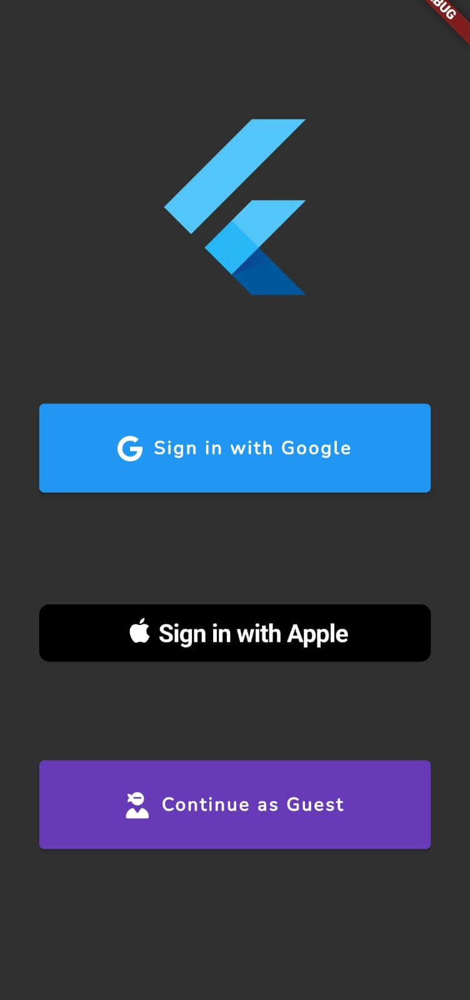
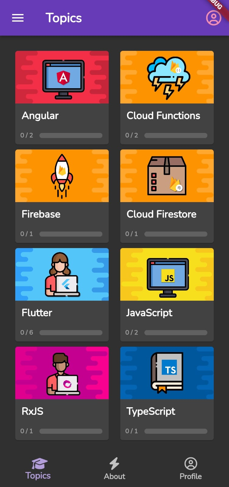
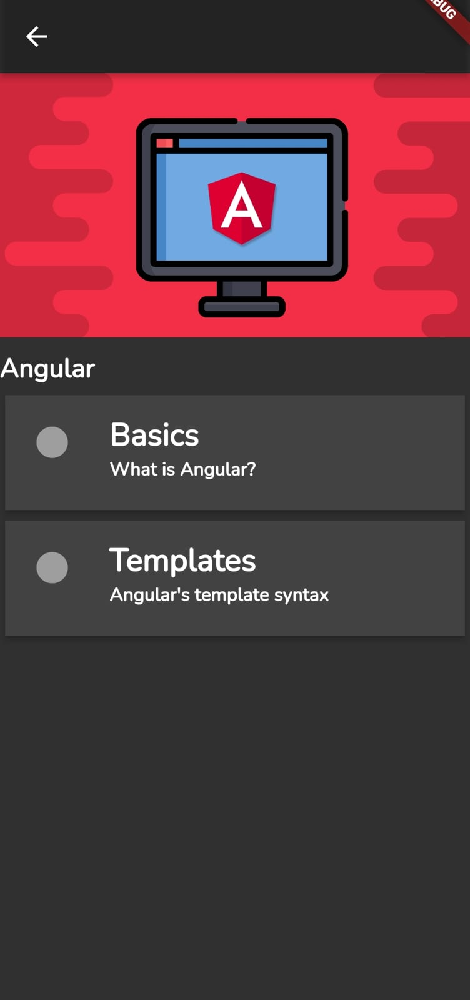
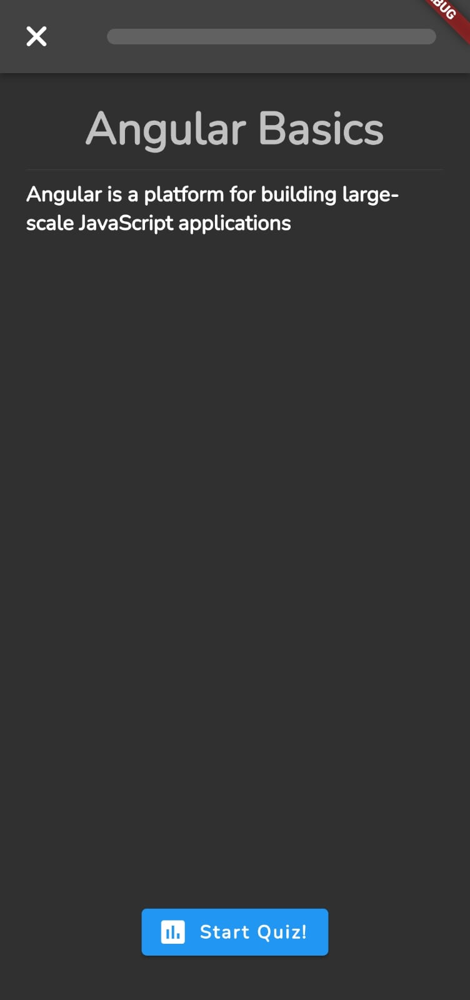
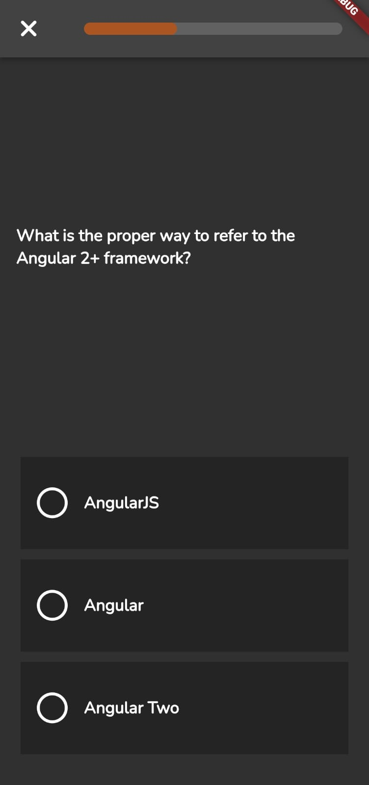

# Codio

Codio is a dynamic quiz application developed using Flutter, offering an interactive experience for users to test their knowledge on various topics.

## Table of Contents

- [Features](#features)
- [Installation](#installation)
- [Usage](#usage)
- [Authentication](#authentication)
- [Screenshots](#screenshots)
- [Contributing](#contributing)
- [License](#license)

## Features

- **User-Friendly Interface**: Codio boasts an intuitive and user-friendly interface that enhances the overall quiz-taking experience.
- **Multiple Categories**: Users can choose from a variety of categories to tailor their quiz experience to their interests.
- **Scoring and Results**: Receive instant feedback on your quiz performance, including a detailed score breakdown and correct/incorrect answers.
- **Anonymous, Google, and Apple Authentication**: Codio now supports multiple authentication methods, including anonymous login, Google authentication, and Apple authentication, providing users with a seamless login experience.
- **Persistent Data**: Codio stores user progress and preferences, allowing for seamless continuation across sessions.

## Installation

To run Codio on your local machine, follow these steps:

1. Clone the repository:

   ```bash
   https://github.com/itsamit108/codio
   ```

2. Navigate to the project directory:

   ```bash
   cd codio
   ```

3. Install dependencies:

   ```bash
   flutter pub get
   ```

4. Run the app:

   ```bash
   flutter run
   ```

## Usage

Once the app is running, you can:

- Select a category for your quiz.
- Start the quiz and answer the questions.
- Review your score and correct answers at the end of the quiz.

## Authentication

Codio supports the following authentication methods:

- **Anonymous Authentication**: Users can choose to participate in quizzes without creating an account.
- **Google Authentication**: Users can log in using their Google accounts for a personalized experience.
- **Apple Authentication**: Apple users can authenticate seamlessly with their Apple IDs.

## Screenshots








## Contributing

We welcome contributions to Codio! To contribute:

1. Fork the repository.
2. Create a new branch: `git checkout -b feature-name`.
3. Make your changes and commit them: `git commit -m 'Add new feature'`.
4. Push to the branch: `git push origin feature-name`.
5. Submit a pull request.

## License

Codio is open-source software licensed under the [MIT license](LICENSE).

Feel free to explore and enhance Codio as you see fit. Happy quizzing!
